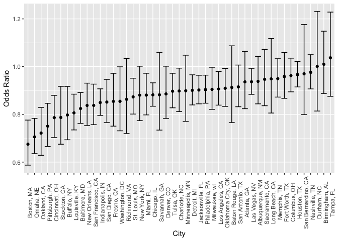
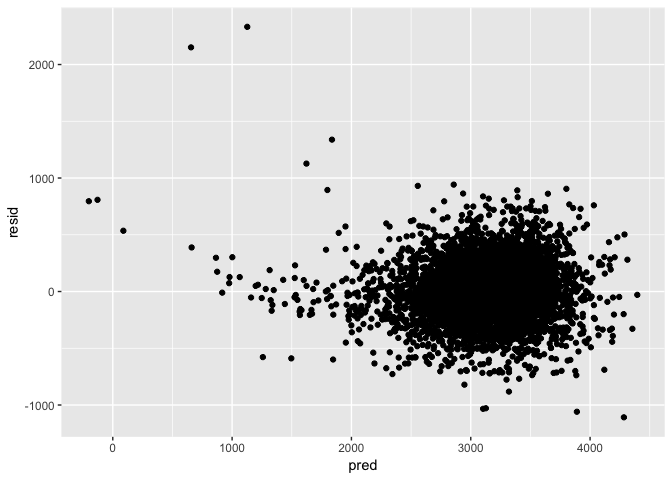

P8105 Homework6
================
Zanis Fang, UID: ZF2213
11/16/2018

### Problem 1

**Data Cleaning:**

``` r
# read data from github repo
homicide <- read_csv("https://raw.githubusercontent.com/washingtonpost/data-homicides/master/homicide-data.csv") %>% 
    # create city_state variable
    unite(col = "city_state", city:state, sep = ", ", remove = FALSE) %>% 
    # create a variable for resolved
    mutate(resolved = as.numeric(disposition %in% "Closed by arrest")) %>%
    # select cities with victim race
    filter(!(city_state %in% c("Dallas, TX",
                                                         "Phoenix, AZ",
                                                         "Kansas City, MO",
                                                         "Tulsa, AL"))) %>%
    # change victim to numeric variable, race into factors
    mutate(victim_age = as.numeric(victim_age),
                 victim_race = if_else(victim_race == "White", "white", "non-white"),
                 victim_race = fct_relevel(victim_race, "white")) 
```

    ## Parsed with column specification:
    ## cols(
    ##   uid = col_character(),
    ##   reported_date = col_integer(),
    ##   victim_last = col_character(),
    ##   victim_first = col_character(),
    ##   victim_race = col_character(),
    ##   victim_age = col_character(),
    ##   victim_sex = col_character(),
    ##   city = col_character(),
    ##   state = col_character(),
    ##   lat = col_double(),
    ##   lon = col_double(),
    ##   disposition = col_character()
    ## )

    ## Warning in evalq(as.numeric(victim_age), <environment>): NAs introduced by
    ## coercion

**Test logistic regression on Baltimore, MD:**

``` r
# get baltimore, MD
glm_test <- homicide %>% filter(city_state == "Baltimore, MD")
# fit logistic model
glm_result <- glm(resolved ~ victim_age + victim_sex + victim_race, data = glm_test)
# tidy the regression output
result_test <- broom::tidy(glm_result)
# 
result_test <- result_test %>%
    janitor::clean_names() %>%
    mutate(conf_upper = estimate + qnorm(0.975) * std_error,
                 conf_lower = estimate - qnorm(0.975) * std_error)

result_test %>%
    filter(term == "victim_racenon-white") %>% 
    select(estimate, conf_upper, conf_lower) %>% 
    knitr::kable()
```

|    estimate | conf\_upper | conf\_lower |
| ----------: | ----------: | ----------: |
| \-0.1930149 | \-0.1146935 | \-0.2713363 |

**Logistic regression on all cities:**

``` r
glm_all_cities <- homicide %>% 
    select(city_state, resolved, victim_age, victim_sex, victim_race) %>%
    group_by(city_state) %>% 
    nest(resolved, victim_age, victim_sex, victim_race) %>%
    # get logistic regression model
    mutate(glm_model = map(.x = data,
                                                 .f = ~ broom::tidy(glm(resolved ~
                                                                                                victim_age + 
                                                                                                victim_sex +
                                                                                                victim_race,
                                                                                             data = .x)))) %>%
    select(city_state, glm_model) %>%
    unnest() %>%
    janitor::clean_names() %>%
    # get confidence interval
    mutate(conf_upper = estimate + qnorm(0.975) * std_error,
                 conf_lower = estimate - qnorm(0.975) * std_error) %>%
    filter(term == "victim_racenon-white") %>%
    mutate(estimate = exp(estimate),
                 conf_upper = exp(conf_upper),
                 conf_lower = exp(conf_lower))
```

**Plot odds ratios with confidence interval:**

``` r
glm_all_cities %>% 
    ggplot(aes(x = fct_reorder(city_state, estimate), y = estimate)) +
    geom_point() +
    geom_errorbar(aes(ymin = conf_lower, ymax = conf_upper), position = "dodge") +
    labs(
        x = "City",
        y = "Odds Ratio"
    ) +
    theme(
        axis.text.x = element_text(angle = 90)
    )
```

<!-- -->

**Comments:** Highest non-white vs white odds ratio of solved cases is
Tempa, FL, and lowest one is Boston, MA. Most cities have odds ratio.
Nashville, TN has largest standard error and Chicago, IL has lowest
standard error. Generally speaking, the cases with non-white victims
have lower solved cases odds ratios.

### Problem 2

``` r
birthweight <- read_csv("./birthweight.csv") %>% 
# recode the factor variables, set controls
    mutate(babysex = fct_recode(as.factor(babysex), "female" = "2", "male" = "1"),
                 babysex = fct_relevel(babysex, "female"),
                 frace = fct_recode(as.factor(frace),
                                                     "white" = "1", "non_white" = "2", "non_white" = "3",
                                                     "non_white" = "4", "non_white" = "8"),
                 frace = fct_relevel(frace, "non_white"),
                 malform = fct_recode(as.factor(malform), "absent" = "0", "present" = "1"),
                 malform = fct_relevel(malform, "absent"),
                 mrace = fct_recode(as.factor(mrace),
                                                     "white" = "1", "non_white" = "2", "non_white" = "3",
                                                     "non_white" = "4"),
                 mrace = fct_relevel(mrace, "non_white")
                 )
```

    ## Parsed with column specification:
    ## cols(
    ##   .default = col_integer(),
    ##   gaweeks = col_double(),
    ##   ppbmi = col_double(),
    ##   smoken = col_double()
    ## )

    ## See spec(...) for full column specifications.

``` r
birthweight_full <- lm(data = birthweight, formula = bwt ~ .)
birthweight %>% skimr::skim()
```

    ## Skim summary statistics
    ##  n obs: 4342 
    ##  n variables: 20 
    ## 
    ## ── Variable type:factor ────────────────────────────────────────────────────────────────────
    ##  variable missing complete    n n_unique                  top_counts
    ##   babysex       0     4342 4342        2 mal: 2230, fem: 2112, NA: 0
    ##     frace       0     4342 4342        2 non: 2219, whi: 2123, NA: 0
    ##   malform       0     4342 4342        2   abs: 4327, pre: 15, NA: 0
    ##     mrace       0     4342 4342        2 non: 2195, whi: 2147, NA: 0
    ##  ordered
    ##    FALSE
    ##    FALSE
    ##    FALSE
    ##    FALSE
    ## 
    ## ── Variable type:integer ───────────────────────────────────────────────────────────────────
    ##  variable missing complete    n      mean     sd  p0  p25    p50  p75 p100
    ##     bhead       0     4342 4342   33.65     1.62  21   33   34     35   41
    ##   blength       0     4342 4342   49.75     2.72  20   48   50     51   63
    ##       bwt       0     4342 4342 3114.4    512.15 595 2807 3132.5 3459 4791
    ##     delwt       0     4342 4342  145.57    22.21  86  131  143    157  334
    ##   fincome       0     4342 4342   44.11    25.98   0   25   35     65   96
    ##  menarche       0     4342 4342   12.51     1.48   0   12   12     13   19
    ##   mheight       0     4342 4342   63.49     2.66  48   62   63     65   77
    ##    momage       0     4342 4342   20.3      3.88  12   18   20     22   44
    ##    parity       0     4342 4342    0.0023   0.1    0    0    0      0    6
    ##   pnumlbw       0     4342 4342    0        0      0    0    0      0    0
    ##   pnumsga       0     4342 4342    0        0      0    0    0      0    0
    ##      ppwt       0     4342 4342  123.49    20.16  70  110  120    134  287
    ##    wtgain       0     4342 4342   22.08    10.94 -46   15   22     28   89
    ##      hist
    ##  ▁▁▁▁▅▇▁▁
    ##  ▁▁▁▁▁▇▁▁
    ##  ▁▁▁▃▇▇▂▁
    ##  ▁▇▅▁▁▁▁▁
    ##  ▁▂▇▂▂▂▁▃
    ##  ▁▁▁▁▂▇▁▁
    ##  ▁▁▁▅▇▂▁▁
    ##  ▂▇▅▂▁▁▁▁
    ##  ▇▁▁▁▁▁▁▁
    ##  ▁▁▁▇▁▁▁▁
    ##  ▁▁▁▇▁▁▁▁
    ##  ▁▇▆▁▁▁▁▁
    ##  ▁▁▁▇▇▁▁▁
    ## 
    ## ── Variable type:numeric ───────────────────────────────────────────────────────────────────
    ##  variable missing complete    n  mean   sd    p0   p25   p50   p75 p100
    ##   gaweeks       0     4342 4342 39.43 3.15 17.7  38.3  39.9  41.1  51.3
    ##     ppbmi       0     4342 4342 21.57 3.18 13.07 19.53 21.03 22.91 46.1
    ##    smoken       0     4342 4342  4.15 7.41  0     0     0     5    60  
    ##      hist
    ##  ▁▁▁▁▃▇▁▁
    ##  ▁▇▅▁▁▁▁▁
    ##  ▇▁▁▁▁▁▁▁

``` r
source('~/Documents/P8130 Biostatistical methods I/homework 5/stepwise_reg.r')

birthweight_lm <- stepwise_reg(data = birthweight, y = "bwt", in_alpha = 0.01, out_alpha = 0.015)

subset_birthweight <-
    birthweight %>%
    select(bwt, bhead, blength, mrace, delwt, gaweeks, smoken, ppbmi, babysex, mheight)
```

Do a stepwise regression, test each candidates if its p value less than
predefined alpha level.

``` r
birthweight %>%
    modelr::add_predictions(model = birthweight_lm[[1]]) %>% 
    modelr::add_residuals(model = birthweight_lm[[1]]) %>% 
    ggplot(aes(x = pred, y = resid)) +
      geom_point()
```

<!-- -->

``` r
bwt_diy <- "bwt ~ bhead + blength + mrace + delwt + gaweeks + smoken + ppbmi + babysex"
bwt_len_ga <- "bwt ~ blength + gaweeks"
bwt_head_len_sex <- "bwt ~ bhead * blength * babysex"


cv_df <- crossv_mc(data = birthweight, n = 100)

cv_df %>%
    mutate(train = map(train, as_tibble),
                 test = map(test, as_tibble)) %>%
    mutate(lm_diy = map(.x = train,
                                            .f = ~lm(formula = as.formula(bwt_diy),
                                                             data = .x)),
                 lm_len_ga = map(.x = train,
                                                .f = ~lm(formula = as.formula(bwt_len_ga),
                                                                 data = .x)),
                 lm_head_len_sex = map(.x = train,
                                                            .f = ~lm(formula = as.formula(bwt_head_len_sex),
                                                                             data = .x))
                 )
```

    ## # A tibble: 100 x 6
    ##    train            test           .id   lm_diy  lm_len_ga lm_head_len_sex
    ##    <list>           <list>         <chr> <list>  <list>    <list>         
    ##  1 <tibble [3,473 … <tibble [869 … 001   <S3: l… <S3: lm>  <S3: lm>       
    ##  2 <tibble [3,473 … <tibble [869 … 002   <S3: l… <S3: lm>  <S3: lm>       
    ##  3 <tibble [3,473 … <tibble [869 … 003   <S3: l… <S3: lm>  <S3: lm>       
    ##  4 <tibble [3,473 … <tibble [869 … 004   <S3: l… <S3: lm>  <S3: lm>       
    ##  5 <tibble [3,473 … <tibble [869 … 005   <S3: l… <S3: lm>  <S3: lm>       
    ##  6 <tibble [3,473 … <tibble [869 … 006   <S3: l… <S3: lm>  <S3: lm>       
    ##  7 <tibble [3,473 … <tibble [869 … 007   <S3: l… <S3: lm>  <S3: lm>       
    ##  8 <tibble [3,473 … <tibble [869 … 008   <S3: l… <S3: lm>  <S3: lm>       
    ##  9 <tibble [3,473 … <tibble [869 … 009   <S3: l… <S3: lm>  <S3: lm>       
    ## 10 <tibble [3,473 … <tibble [869 … 010   <S3: l… <S3: lm>  <S3: lm>       
    ## # ... with 90 more rows
