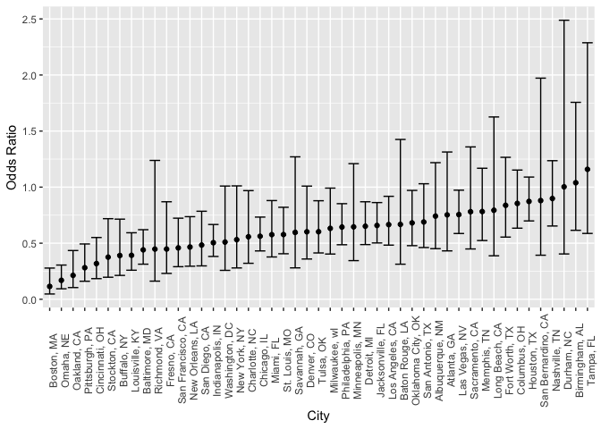
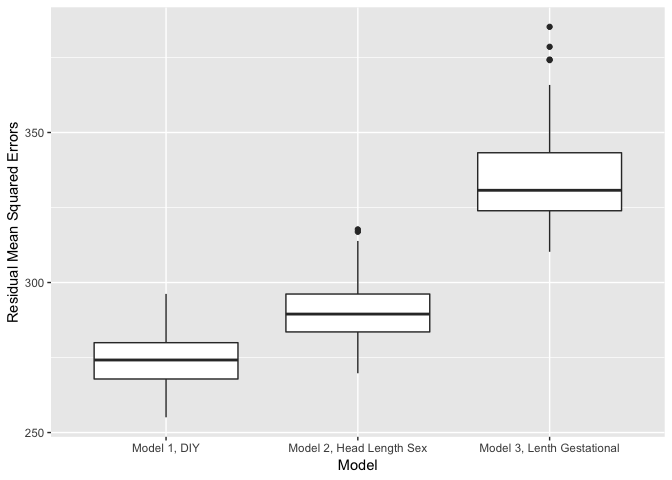

P8105 Homework6
================
Zanis Fang, UID: ZF2213
11/16/2018

### Problem 1

**Data Cleaning:**

``` r
# read data from github repo
homicide <- read_csv("https://raw.githubusercontent.com/washingtonpost/data-homicides/master/homicide-data.csv") %>% 
    # create city_state variable
    unite(col = "city_state", city:state, sep = ", ", remove = FALSE) %>% 
    # create a variable for resolved
    mutate(resolved = as.numeric(disposition %in% "Closed by arrest")) %>% 
    # select cities with victim race
    filter(!(city_state %in% c("Dallas, TX",
                                                         "Phoenix, AZ",
                                                         "Kansas City, MO",
                                                         "Tulsa, AL"))) %>% 
    # change victim to numeric variable, race into factors
    mutate(victim_age = as.numeric(victim_age),
                 victim_race = if_else(victim_race == "White", "white", "non-white"),
                 victim_sex = as.factor(victim_sex),
                 victim_race = fct_relevel(victim_race, "white")) 
```

    ## Parsed with column specification:
    ## cols(
    ##   uid = col_character(),
    ##   reported_date = col_integer(),
    ##   victim_last = col_character(),
    ##   victim_first = col_character(),
    ##   victim_race = col_character(),
    ##   victim_age = col_character(),
    ##   victim_sex = col_character(),
    ##   city = col_character(),
    ##   state = col_character(),
    ##   lat = col_double(),
    ##   lon = col_double(),
    ##   disposition = col_character()
    ## )

    ## Warning in evalq(as.numeric(victim_age), <environment>): NAs introduced by
    ## coercion

**Test logistic regression on Baltimore, MD:**

``` r
# get baltimore, MD
glm_test <- homicide %>% filter(city_state == "Baltimore, MD")
# fit logistic model
glm_result <- glm(resolved ~ victim_age + victim_sex + victim_race, data = glm_test)
# tidy the regression output
result_test <- broom::tidy(glm_result)
# 
result_test <- result_test %>%
    janitor::clean_names() %>%
    mutate(conf_upper = estimate + qnorm(0.975) * std_error,
                 conf_lower = estimate - qnorm(0.975) * std_error)

result_test %>%
    filter(term == "victim_racenon-white") %>% 
    select(estimate, conf_upper, conf_lower) %>% 
    knitr::kable()
```

|    estimate | conf\_upper | conf\_lower |
| ----------: | ----------: | ----------: |
| \-0.1930149 | \-0.1146935 | \-0.2713363 |

**Logistic regression on all cities:**

``` r
glm_all_cities <- homicide %>% 
    select(city_state, resolved, victim_age, victim_sex, victim_race) %>%
    group_by(city_state) %>% 
    nest(resolved, victim_age, victim_sex, victim_race) %>%
    # get logistic regression model
    mutate(glm_model = map(.x = data, .f = ~ broom::tidy(glm(resolved ~ victim_age + victim_sex + victim_race, data = .x)))) %>%
    select(city_state, glm_model) %>%
    unnest() %>%
    janitor::clean_names() %>%
    # get confidence interval
    mutate(conf_upper = estimate + qnorm(0.975) * std_error,
                 conf_lower = estimate - qnorm(0.975) * std_error) %>%
    filter(term == "victim_racenon-white") %>%
    mutate(estimate = exp(estimate),
                 conf_upper = exp(conf_upper),
                 conf_lower = exp(conf_lower))
```

**Plot odds ratios with confidence interval:**

``` r
glm_all_cities %>% 
    ggplot(aes(x = fct_reorder(city_state, estimate), y = estimate)) +
    geom_point() +
    geom_errorbar(aes(ymin = conf_lower, ymax = conf_upper), position = "dodge") +
    labs(
        x = "City",
        y = "Odds Ratio"
    ) +
    theme(
        axis.text.x = element_text(angle = 90)
    )
```

<!-- -->

**Comments:** Highest non-white vs white odds ratio of solved cases is
Tempa, FL, and lowest one is Boston, MA. Most cities have odds ratio.
Nashville, TN has largest standard error and Chicago, IL has lowest
standard error. Generally speaking, the cases with non-white victims
have lower solved cases odds ratios.

### Problem 2

``` r
birthweight <- read_csv("./birthweight.csv") %>% 
  # recode the factor variables
  # note that for father and mother's races, half is white and half is non white,
    # so collapse to two categories
    mutate(babysex = fct_recode(as.factor(babysex), "female" = "2", "male" = "1"),
                 # female as reference
                 babysex = fct_relevel(babysex, "female"),
                 frace = fct_recode(as.factor(frace),
                                                     "white" = "1", "non_white" = "2", "non_white" = "3",
                                                     "non_white" = "4", "non_white" = "8"),
                 # non-white as reference
                 frace = fct_relevel(frace, "non_white"),
                 malform = fct_recode(as.factor(malform), "absent" = "0", "present" = "1"),
                 # non malformation as reference
                 malform = fct_relevel(malform, "absent"),
                 mrace = fct_recode(as.factor(mrace),
                                                     "white" = "1", "non_white" = "2", "non_white" = "3",
                                                     "non_white" = "4"),
                 # non-white as reference
                 mrace = fct_relevel(mrace, "non_white")
                 )
```

    ## Parsed with column specification:
    ## cols(
    ##   .default = col_integer(),
    ##   gaweeks = col_double(),
    ##   ppbmi = col_double(),
    ##   smoken = col_double()
    ## )

    ## See spec(...) for full column specifications.

Turn father’s race, mother’s race, malformation, baby’s sex into factor
variables. Since black and white are majority, collapse the race
variables into two categories, white and non-white.

``` r
stepwise_reg <- function(data, y, in_alpha = 0.1) {

### Local variable dictionary with starting values
    
    # 1. outcome column
  outcome <- data[, y]
    
    # 2. included and not included predictors, depend on the direction
    
      # initiating included predictors
    inside_pred <- data %>% select(-everything())
    # initiating not included predictors
    outside_pred <- data %>% select(-y)
    
    # 3. a temporary dataframe for regression, test coefficients
 temp_dataframe <- cbind(outcome, outside_pred, inside_pred)
    
    # 4. get terms of regression, for categorical variables the term names ...
    #    ... are different from predictor names
  full_model <- lm(data = temp_dataframe, formula = as.formula(paste(y, "~ .")))
  term_name <- (full_model$coefficients %>% names())[-1]
    
    # 5. predictor names, useful for link term names
  predictor_pool <- colnames(temp_dataframe)
  
    # 6. a table to record p values for each selection procedure
  p_value_history <- tibble(term = term_name)
    
    # 7. record selection history, which to include, which to remove
  sel_history <- c()
    
    # 8. dataframe to store p values for candidates to include
  temp_to_include <- tibble()
    
    # 9. initiating controller for while loop
  controller <- TRUE
    
    # 10. initiating variable to store chosen predictor
    selected_pred <- c()
    
    # 11. maximum p value during exclusion process
    min_p <- 0
    
    # 12. record step number
    step_no <- 1
    
    while (controller) {
        
    
        
        # empty the include temporary dataframe
        temp_to_include <- tibble()
            
        # test statistics for predictors in candidates pool one by one ...
        # ... and choose the one with smallest p-value if it is smaller than alpha level
        
        for (i in 1:ncol(outside_pred)) {
            # create a temporary dataset combining:
            # outcome, predictors already included, and the candidate to be test
            temp_dataframe <- cbind(outcome, outside_pred[i], inside_pred)
                
            # get tidy regression summary after adding a new predictor
            temp_lm <- lm(data = temp_dataframe, as.formula(paste(y, "~ ."))) %>%
                summary() %>% broom::tidy()
                
            # create a table for all the statistics for the candidates in this while round
            temp_to_include <- rbind(temp_to_include, temp_lm %>%
                                                                    filter(str_detect(temp_lm$term,
                                                                                                        colnames(temp_dataframe)[[2]])))
            }
            
        # get minimum p value
        min_p <- min(temp_to_include$p.value, na.rm = TRUE)
            
        # get predictor name of minimum p value, since occasionally two predictors
        # have same p value, select only one of them
        min_pred <- (temp_to_include %>% filter(p.value == min_p))$term[1]
            
        # for categorical variable, lm function will name the predictor
        # as (predictorname) + (categorical level), so for the downstream
        # process, we need to detect the predictor name correctly:
        selected_pred <- predictor_pool[str_detect(min_pred, predictor_pool)]
        
        # record history
        p_value_history <- full_join(x = p_value_history,
                                                                 y = temp_to_include %>% select(term, p.value),
                                                                 by = "term")
        
        # include if minimum p smaller than alpha level
        if (min_p < in_alpha) {
            # record selection history
            print(paste("step", step_no, ": predictor", selected_pred,
                                    "with minimum p value", min_p, "<",
                                    in_alpha, ", continue,"))
            # add predictor into the model
            inside_pred <- cbind(inside_pred, data[, selected_pred])
            outside_pred <- outside_pred %>% select(-selected_pred)
        }
        
        if (min_p >= in_alpha) {
            print(paste("step", step_no, ": predictor", selected_pred,
                                    "with minimum p value", min_p, ">",
                                    in_alpha, ", end search."))
        }
        
        # if nothing in the candidates pool to be included,
        # then controller will be false 
        controller <- min_p < in_alpha
        step_no = step_no + 1
    }
    
    # name the column with each round
    colnames(p_value_history)[2:ncol(p_value_history)] <-
        paste("round", c(1:100), "p_value", sep = "_")[1:(ncol(p_value_history) - 1)]
    
    # selected model
    temp_dataframe <- cbind(outcome, inside_pred)
    selected_model <- lm(data = temp_dataframe, as.formula(paste(y, "~ .")))
    return(list(model = selected_model,
                            p_history = p_value_history,
                            selection_history = sel_history))
}

# forward selection
birthweight_lm <- stepwise_reg(data = birthweight, y = "bwt", in_alpha = 0.01)
```

    ## [1] "step 1 : predictor bhead with minimum p value 0 < 0.01 , continue,"
    ## [1] "step 2 : predictor blength with minimum p value 2.60388119876156e-310 < 0.01 , continue,"
    ## [1] "step 3 : predictor mrace with minimum p value 2.67353131551678e-47 < 0.01 , continue,"
    ## [1] "step 4 : predictor delwt with minimum p value 2.19844841429532e-27 < 0.01 , continue,"
    ## [1] "step 5 : predictor gaweeks with minimum p value 5.26901436629424e-16 < 0.01 , continue,"
    ## [1] "step 6 : predictor smoken with minimum p value 3.16388969770555e-16 < 0.01 , continue,"
    ## [1] "step 7 : predictor ppbmi with minimum p value 1.46778063051686e-10 < 0.01 , continue,"
    ## [1] "step 8 : predictor babysex with minimum p value 0.000604794347554149 < 0.01 , continue,"
    ## [1] "step 9 : predictor parity with minimum p value 0.0181719918778636 > 0.01 , end search."

``` r
birthweight_lm[[1]] %>%
    summary() %>%
    broom::tidy()
```

    ## # A tibble: 9 x 5
    ##   term        estimate std.error statistic   p.value
    ##   <chr>          <dbl>     <dbl>     <dbl>     <dbl>
    ## 1 (Intercept) -5794.      97.5      -59.4  0.       
    ## 2 bhead         132.       3.43      38.5  3.45e-279
    ## 3 blength        74.8      2.02      37.0  5.22e-261
    ## 4 mracewhite    138.       8.88      15.6  3.99e- 53
    ## 5 delwt           3.50     0.280     12.5  3.18e- 35
    ## 6 gaweeks        11.6      1.46       7.98 1.87e- 15
    ## 7 smoken         -4.84     0.586     -8.26 1.84e- 16
    ## 8 ppbmi         -12.2      1.90      -6.40 1.67e- 10
    ## 9 babysexmale   -29.0      8.45      -3.43 6.05e-  4

Do a stepwise forward regression: Start with a model with only
intercept, Y \~ 1, fit each predictors into the model to see if its p
value less than predefined alpha level, if p value small than predefined
alpha level, then add to the model, Y \~ X1. Then, fit the remaining
predictors one by one into the model with X1, if the p value small than
predefined alpha level, then add to the model, Y \~ X1 + X2. Repeat the
cycles until no remaining predictors will have p value less than
predefined alpha level, return the model and selection history. Define a
function to do the stepwise regression, note that this function only
works for factor variable with two levels. frace and mrace has strong
correlation, ppbmi and wtgain also has strong correlation. They will
cause multicollinearity issues if both partners in each pair exist in
the model.

``` r
# plot residue mean squre errors against predictions
birthweight %>%
    # add predictions
    modelr::add_predictions(model = birthweight_lm[[1]]) %>% 
    # add residuals
    modelr::add_residuals(model = birthweight_lm[[1]]) %>% 
    # plot
    ggplot(aes(x = pred, y = resid)) +
      geom_point() +
      labs(
        x = "Fitted values (birth weight (grams))",
        y = "Residuals"
      )
```

<!-- -->

Model \#1:

baby’s head circumference (cm),

baby’s birth length (cm),

mother’s race,

mother’s weight at delivery (pounds),

gestational age (week),

cigarettes smoked per day during pregnancy,

mother’s pregnancy BMI,

baby’s sex

Model \#2:

baby’s head circumference (cm),

baby’s length (cm),

baby’s sex

Model \#3:

baby’s length (cm),

gestational age (week)

``` r
# diy model
bwt_diy <- "bwt ~ bhead + blength + mrace + delwt + gaweeks + smoken + ppbmi + babysex"
# baby's length (cm) and gestational age (week)
bwt_len_ga <- "bwt ~ blength + gaweeks"
# baby's head circumference (cm), baby's length (cm), baby's sex, and all interactions
bwt_head_len_sex <- "bwt ~ bhead * blength * babysex"

set.seed(29)

# generate training sets and test sets
crossv_mc(data = birthweight, n = 100) %>% 
    # coerce to data frame
    mutate(train = map(train, as_tibble),
                 test = map(test, as_tibble)) %>%
    # generate three models to training sets
    mutate(lm_diy = map(.x = train,
                                            .f = ~lm(formula = as.formula(bwt_diy),
                                                             data = .x)),
                 lm_len_ga = map(.x = train,
                                                .f = ~lm(formula = as.formula(bwt_len_ga),
                                                                 data = .x)),
                 lm_head_len_sex = map(.x = train,
                                                            .f = ~lm(formula = as.formula(bwt_head_len_sex),
                                                                             data = .x))
                 ) %>% 
    # calculate residue mean square errors of test datasets
    mutate(rmse_diy = map2_dbl(.x = lm_diy,
                                                         .y = test,
                                                         .f = ~rmse(model = .x, data = .y)),
                 rmse_len_ga = map2_dbl(.x = lm_len_ga,
                                                             .y = test,
                                                             .f = ~rmse(model = .x, data = .y)),
                 rmse_head_len_sex = map2_dbl(.x = lm_head_len_sex,
                                                                         .y = test,
                                                                         .f = ~rmse(model = .x, data = .y))
    ) %>% 
    # get mean square error
    select(starts_with("rmse")) %>% 
    gather(key = model, value = rmse) %>%
    mutate(model = recode(model, "rmse_diy" = "Model 1, DIY",
                                                "rmse_len_ga" = "Model 3, Lenth Gestational",
                                                "rmse_head_len_sex" = "Model 2, Head Length Sex")) %>%
    # plot residual mean square error of the three models
    ggplot(aes(x = model, y = rmse)) +
      geom_boxplot() +
        labs(
            x = "Model",
            y = "Residual Mean Squared Errors"
        )
```

<!-- -->

**Comments:** It seems forward stepwise regression get best models among
the three, the \#2 model is in the middle, \#3 model is worst.
